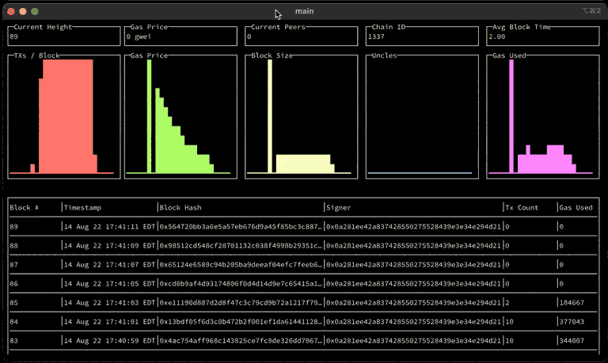

# Polycli

We run a lot of different blockchain technologies. Different tools often have inconsistent tooling and this makes automation and operations painful. The goal of this codebase is to standardize some of our commonly needed tools and provide interfaces and formats.

## Summary

- [Install](#install)
- [Features](#features)
- [Testing](#testing)
- [Contributing](#contributing)
- [Reference](#reference)

## Install

Requirements:

- [Go](https://go.dev/)
- make
- jq
- bc
- protoc (Only required for `make generate`)

To install, clone this repo and run:

```bash
$ make install
```

By default, the commands will be in `$HOME/go/bin/`, so for ease, we recommend adding that path to your shell's startup file by adding the following line:

```bash
export PATH="$HOME/go/bin:$PATH"
```

## Features



Note: Do not modify this section! It is auto-generated by `cobra` using `make gen-doc`.

<generated>

- [polycli abi](doc/polycli_abi.md) - Provides encoding and decoding functionalities with contract signatures and ABI.

- [polycli dbbench](doc/polycli_dbbench.md) - Perform a level/pebble db benchmark

- [polycli dumpblocks](doc/polycli_dumpblocks.md) - Export a range of blocks from a JSON-RPC endpoint.

- [polycli ecrecover](doc/polycli_ecrecover.md) - Recovers and returns the public key of the signature

- [polycli enr](doc/polycli_enr.md) - Convert between ENR and Enode format

- [polycli fork](doc/polycli_fork.md) - Take a forked block and walk up the chain to do analysis.

- [polycli fund](doc/polycli_fund.md) - Bulk fund crypto wallets automatically.

- [polycli hash](doc/polycli_hash.md) - Provide common crypto hashing functions.

- [polycli loadtest](doc/polycli_loadtest.md) - Run a generic load test against an Eth/EVM style JSON-RPC endpoint.

- [polycli metrics-to-dash](doc/polycli_metrics-to-dash.md) - Create a dashboard from an Openmetrics / Prometheus response.

- [polycli mnemonic](doc/polycli_mnemonic.md) - Generate a BIP39 mnemonic seed.

- [polycli monitor](doc/polycli_monitor.md) - Monitor blocks using a JSON-RPC endpoint.

- [polycli nodekey](doc/polycli_nodekey.md) - Generate node keys for different blockchain clients and protocols.

- [polycli p2p](doc/polycli_p2p.md) - Set of commands related to devp2p.

- [polycli parseethwallet](doc/polycli_parseethwallet.md) - Extract the private key from an eth wallet.

- [polycli rpcfuzz](doc/polycli_rpcfuzz.md) - Continually run a variety of RPC calls and fuzzers.

- [polycli signer](doc/polycli_signer.md) - Utilities for security signing transactions

- [polycli version](doc/polycli_version.md) - Get the current version of this application

- [polycli wallet](doc/polycli_wallet.md) - Create or inspect BIP39(ish) wallets.

</generated>

## Testing

To test the features of `polycli`, we'll run geth in `dev` mode but you can run any node you want.

```bash
$ make geth
INFO [07-10|10:43:12.499] Starting Geth in ephemeral dev mode...
...
```

You can then fund the default load testing account and run some tests.

```bash
$ make geth-loadtest
10:57AM INF Starting Load Test
10:57AM INF Connecting with RPC endpoint to initialize load test parameters
...
```

You can view the state of the chain using `polycli`.

```bash
$ polycli monitor --rpc-url http://127.0.0.1:8545
```


You can also interact manually with your node, you can attach a Javascript console to your node using IPC.

First, wait for the IPC endpoint to open.

```bash
INFO [07-10|10:44:29.250] Starting peer-to-peer node               instance=Geth/v1.12.0-stable/darwin-amd64/go1.20.4
WARN [07-10|10:44:29.250] P2P server will be useless, neither dialing nor listening
INFO [07-10|10:44:29.255] Stored checkpoint snapshot to disk       number=0 hash=039839..dcb5c1
DEBUG[07-10|10:44:29.255] IPCs registered                          namespaces=admin,debug,web3,eth,txpool,clique,miner,net,engine
INFO [07-10|10:44:29.256] IPC endpoint opened                      url=/var/folders/7m/3_x4ns7557x52hb6vncqkx8h0000gn/T/geth.ipc
INFO [07-10|10:44:29.256] Generated ephemeral JWT secret           secret=0x7511b4e6312a1a63348d8fc8c6a586ed4ea69ed31c27b3c0cc5e41cb6d2d5822
```

Then, attach a console to your node.

```bash
$ geth attach /var/folders/7m/3_x4ns7557x52hb6vncqkx8h0000gn/T/geth.ipc
Welcome to the Geth JavaScript console!

instance: Geth/v1.12.0-stable/darwin-amd64/go1.20.4
coinbase: 0x760f66cae63cb561ed0ef29d5e005f44215e2ba2
at block: 8 (Mon Jul 10 2023 10:49:07 GMT+0200 (CEST))
 datadir:
 modules: admin:1.0 clique:1.0 debug:1.0 engine:1.0 eth:1.0 miner:1.0 net:1.0 rpc:1.0 txpool:1.0 web3:1.0

To exit, press ctrl-d or type exit
>
```

From there, you can do anything such as funding the default load testing account with some currency.

```bash
> eth.coinbase==eth.accounts[0]
true

> eth.sendTransaction({from: eth.coinbase, to: "0x85da99c8a7c2c95964c8efd687e95e632fc533d6", value: web3.toWei(5000, "ether")})
"0xd8223589989d198741e0543ab01d9d3ce2b81e38927cb213a56589e111dfd388"
```

You can then generate some load to make sure that blocks with transactions are being created. Note that the chain id of local geth is `1337`.

```bash
$ polycli loadtest --verbosity 700 --chain-id 1337 --concurrency 1 --requests 1000 --rate-limit 5 --mode c --rpc-url http://127.0.0.1:8545
```

## Monitor Debug
`polycli monitor --rpc-url http://34.117.145.249:80 -v 700 &> log.txt`

# Contributing

- If you add a new loadtest mode, don't forget to update the loadtest mode string by running the following command: `cd cmd/loadtest && stringer -type=loadTestMode`. You can install [stringer](https://pkg.go.dev/golang.org/x/tools/cmd/stringer) with `go install golang.org/x/tools/cmd/stringer@latest`.

## Contact

For more discussions, please head to the [R&D Discord](https://discord.gg/0xPolygonRnD)

# Reference

Sending some value to the default load testing account.

Listening for re-orgs.

```bash
socat - UNIX-CONNECT:/var/folders/zs/k8swqskj1t79cgnjh6yt0fqm0000gn/T/geth.ipc
{"id": 1, "method": "eth_subscribe", "params": ["newHeads"]}
```

Useful RPCs when testing.

```bash
curl -v -H 'Content-Type: application/json' -d '{"jsonrpc":"2.0", "id": 1, "method": "net_version", "params": []}' https://polygon-rpc.com
curl -v -H 'Content-Type: application/json' -d '{"jsonrpc":"2.0", "id": 1, "method": "eth_blockNumber", "params": []}' https://polygon-rpc.com
curl -v -H 'Content-Type: application/json' -d '{"jsonrpc":"2.0", "id": 1, "method": "eth_getBlockByNumber", "params": ["0x1DE8531", true]}' https://polygon-rpc.com
curl -v -H 'Content-Type: application/json' -d '{"jsonrpc":"2.0", "id": 1, "method": "clique_getSigner", "params": ["0x1DE8531", true]}' https://polygon-rpc.com
curl -v -H 'Content-Type: application/json' -d '{"jsonrpc":"2.0", "id": 1, "method": "eth_getBalance", "params": ["0x85da99c8a7c2c95964c8efd687e95e632fc533d6", "latest"]}' https://polygon-rpc.com
curl -v -H 'Content-Type: application/json' -d '{"jsonrpc":"2.0", "id": 1, "method": "eth_getCode", "params": ["0x79954f948079ee9ef1d15eff3e07ceaef7cdf3b4", "latest"]}' https://polygon-rpc.com


curl -v -H 'Content-Type: application/json' -d '{"jsonrpc":"2.0", "id": 1, "method": "txpool_inspect", "params": []}' http://localhost:8545
curl -v -H 'Content-Type: application/json' -d '{"jsonrpc":"2.0", "id": 1, "method": "txpool_status", "params": []}' http://localhost:8545
curl -v -H 'Content-Type: application/json' -d '{"jsonrpc":"2.0", "id": 1, "method": "eth_gasPrice", "params": []}' http://localhost:8545
curl -v -H 'Content-Type: application/json' -d '{"jsonrpc":"2.0", "id": 1, "method": "admin_peers", "params": []}' http://localhost:8545
```

```bash
websocat ws://34.208.176.205:9944
{"jsonrpc":"2.0", "id": 1, "method": "chain_subscribeNewHead", "params": []}
```
