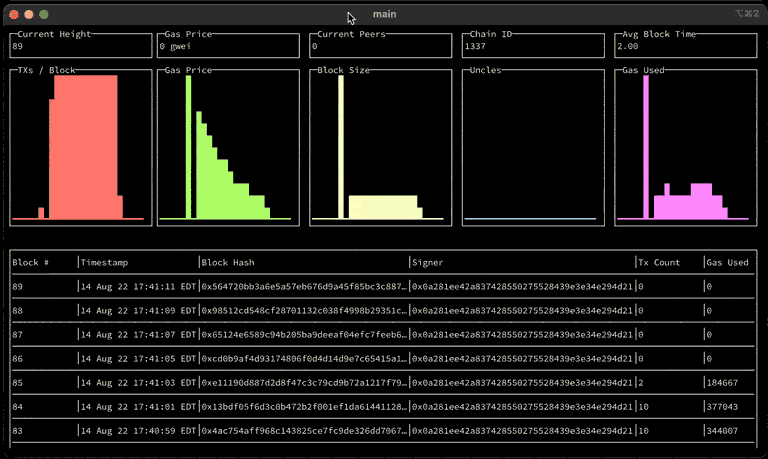

We run a lot of different blockchain technologies. Different tools often
have inconsistent tooling and this makes automation and operations
painful. The goal of this codebase is to standardize some of our
commonly needed tools and provide interfaces and formats.

# Install

Requirements:

- [Go](https://go.dev/)

To install, clone this repo and run:

``` bash
$ make install
```

By default, the commands will be in `$HOME/go/bin/`, so for ease, we
recommend adding that path to your shell's startup file by adding the
following line:

``` bash
export PATH="$HOME/go/bin:$PATH"
```

# Hash

The `hash` command provides a simple mechanism to perform hashes on
files, standard input, and arguments. Below shows various ways to
provide input.

``` bash
$ echo -n "hello" > hello.txt
$ polycli hash sha1 --file hello.txt
aaf4c61ddcc5e8a2dabede0f3b482cd9aea9434d
$ echo -n "hello" | polycli hash sha1
aaf4c61ddcc5e8a2dabede0f3b482cd9aea9434d
$ polycli hash sha1 hello
aaf4c61ddcc5e8a2dabede0f3b482cd9aea9434d
```

We've provided many standard hashing functions

``` shell
echo -n "hello" | polycli hash md4
echo -n "hello" | polycli hash md5
echo -n "hello" | polycli hash sha1
echo -n "hello" | polycli hash sha224
echo -n "hello" | polycli hash sha256
echo -n "hello" | polycli hash sha384
echo -n "hello" | polycli hash sha512
echo -n "hello" | polycli hash ripemd160
echo -n "hello" | polycli hash sha3_224
echo -n "hello" | polycli hash sha3_256
echo -n "hello" | polycli hash sha3_384
echo -n "hello" | polycli hash sha3_512
echo -n "hello" | polycli hash sha512_224
echo -n "hello" | polycli hash sha512_256
echo -n "hello" | polycli hash blake2s_256
echo -n "hello" | polycli hash blake2b_256
echo -n "hello" | polycli hash blake2b_384
echo -n "hello" | polycli hash blake2b_512
echo -n "hello" | polycli hash keccak256
echo -n "hello" | polycli hash keccak512
```

# Mnemonic

The `mnemonic` command is a simple way to generate
[BIP-0039](https://github.com/bitcoin/bips/blob/master/bip-0039.mediawiki)
mnemonics.

``` shell
polycli mnemonic
polycli mnemonic --language spanish
polycli mnemonic --language spanish --words 12
```

# Wallet

The `wallet` command can generate portable wallets to be used across
ETH, BTC, Polygon, Avail, etc.

In the example, we're generating a wallet with a few flags that are used
to configure how many wallets are generated and how the seed phrase is
used to generate the wallets.

``` shell
polycli wallet create --raw-entropy --root-only --words 15 --language english
```

In addition to generating wallets with new mnemonics, you can use a
known mnemonic to generate wallets. **Caution** entering your seed
phrase in the command line should only be done for test mnemonics. Never
do this with a real seed phrase. The example below is a test vector from
Substrate
[BIP-0039](https://github.com/paritytech/substrate-bip39/blob/eef2f86337d2dab075806c12948e8a098aa59d59/src/lib.rs#L74)
where the expected seed is
`44e9d125f037ac1d51f0a7d3649689d422c2af8b1ec8e00d71db4d7bf6d127e33f50c3d5c84fa3e5399c72d6cbbbbc4a49bf76f76d952f479d74655a2ef2d453`

``` shell
polycli wallet inspect --raw-entropy --root-only --language english --password "Substrate" --mnemonic "abandon abandon abandon abandon abandon abandon abandon abandon abandon abandon abandon about"
```

This command also leverages the BIP-0032 library for hierarchically
derived wallets.

``` shell
polycli wallet create --path "m/44'/0'/0'" --addresses 5
```

# Loadtest

The `loadtest` tool is meant to generate various types of load against
RPC end points. It leverages the
[`ethclient`](https://pkg.go.dev/github.com/ethereum/go-ethereum/ethclient)
library Go Ethereum to interact with the blockchain.

``` shell
polycli loadtest --help
```

Most of the options are expected in the help text. The default private
key is:
`42b6e34dc21598a807dc19d7784c71b2a7a01f6480dc6f58258f78e539f1a1fa`. We
can use `wallet inspect` to get more information about this address, in
particular its `ETHAddress` if you want to check balance or pre-mine
value for this particular account.

``` shell
polycli wallet inspect  --mnemonic "code code code code code code code code code code code quality" --addresses 1
```

The `--mode` flag is important for this command:

- `t` We'll only performance transfers to the `--to-address`. This is a
  fast and common operation.
- `d` Will deploy the load testing contract over and over again
- `c` Will call random functions in our load test contract
- `f` will call a specific function on the load test contract. The
  function is specified using the `-f` flag

This example is very simple. It runs 1000 requests at a max rate of 1
request per second against the http rpc endpoint on localhost. t's
running in transaction mode so it will perform simple transactions send
to the default address.

``` shell
polycli loadtest --verbosity 700 --chain-id 1256 --concurrency 1 --requests 1000 --rate-limit 1 --mode t http://localhost:8888
```

This example runs slower and specifically calls the
[LOG4](https://www.evm.codes/#a4) function in the load test contract in
a loop for 25,078 iterations. That number was picked specifically to
require almost all of the gas for a single transaction.

``` shell
polycli loadtest --verbosity 700 --chain-id 1256 --concurrency 1 --requests 50 --rate-limit 0.5  --mode f --function 164 --iterations 25078 http://private.validator-001.devnet02.pos-v3.polygon.private:8545
```

## Avail / Substrate

The loadtest tool works with Avail, but not with the same level of
functionality. There's no EVM so the functional calls will not work.
This is a basic example which would transfer value in a loop 10 times

``` shell
polycli loadtest --app-id 0 --to-random=true  --data-avail --verbosity 700 --chain-id 42 --concurrency 1 --requests 10 --rate-limit 1 --mode t 'http://devnet01.dataavailability.link:8545'
```

This is a similar test but storing random nonsense hexwords

``` shell
polycli loadtest --app-id 0 --data-avail --verbosity 700 --chain-id 42 --concurrency 1 --requests 10 --rate-limit 1 --mode s --byte-count 16384 'http://devnet01.dataavailability.link:8545'
```

# Monitor



This is a basic tool for monitoring block production on a local RPC end
point.

If you're using the terminal UI and you'd like to be able to select text
for copying, you might need to use a modifier key.

# Nodekey

The `nodekey` command is still in progress, but the idea is to have a
simple command for generating a node key. Most clients will generate
this on the fly, but if we want to store the key pair during an
automated provisioning process, it's helpful to have the output be
structured

``` shell
polycli nodekey
```

# RPC

This is a simple tool to avoid typing JSON on the command line while
making RPC calls. The implementation is generic and this is meant to be
a complete generic RPC tool.

``` shell

polycli rpc https://polygon-rpc.com eth_blockNumber

polycli rpc https://polygon-rpc.com eth_getBlockByNumber 0x1e99576 true
```

# Dumpblocks

For various reasons, we might want to dump a large range of blocks for
analytics or replay purposes. This is a simple util to export over RPC a
range of blocks.

This would download the first 500K blocks and zip them and then look for
blocks with transactions that create an account.

``` shell
polycli dumpblocks http://172.26.26.12:8545/ 0 500000 | gzip > foo.gz

zcat < foo.gz | jq '. | select(.transactions | length > 0) | select(.transactions[].to == null)'
```

# Metrics To Dash

Given an openmetrics / prometheus response, create a json file that can
be used to create a dashboard with all of the metrics in one view

``` shell
go run main.go metrics-to-dash -i avail-metrics.txt -p avail. -t "Avail Devnet Dashboard" -T basedn -D devnet01.avail.polygon.private -T host -D validator-001 -s substrate_ -s sub_ -P true -S true
go run main.go metrics-to-dash -i avail-light-metrics.txt -p avail_light. -t "Avail Light Devnet Dashboard" -T basedn -D devnet01.avail.polygon.private -T host -D validator-001 -s substrate_ -s sub_ -P true -S true

```

# Adding Commands

Script to setup this repo

``` bash
cobra-cli init
cobra-cli add version
cobra-cli add hash
cobra-cli add mnemonic
```

This is the content of my `~/.cobra.yaml` file

``` yaml
---
author: Polygon <engineering@polygon.technology>
license: lgpl-3.0
useViper: true
```

# Testing with Geth

While working on some of the Polygon CLI tools, we'll run geth in dev
mode in order to make sure the various functions work properly. First,
we'll startup geth.

``` shell
# Geth
./build/bin/geth --dev --dev.period 2 --http --http.addr localhost --http.port 8545 --http.api admin,debug,web3,eth,txpool,personal,miner,net --verbosity 5 --rpc.gascap 50000000  --rpc.txfeecap 0 --miner.gaslimit  10 --miner.gasprice 1 --gpo.blocks 1 --gpo.percentile 1 --gpo.maxprice 10 --gpo.ignoreprice 2 --dev.gaslimit 50000000


# v3
go run main.go server --dev \
    --dev.period 2 \
    --ws --ws.port 8546 \
    --http --http.port 8545 \
    --jsonrpc.modules eth,web3,personal,net \
    --log-level debug \
    --ipcpath ./borv3ipc \
    --rpc.gascap 18446744073709551615 \
    --rpc.txfeecap 0 \
    --miner.gaslimit  10 \
    --miner.gasprice 1 \
    --gpo.blocks 1 \
    --gpo.percentile 1 \
    --gpo.maxprice 10 \
    --gpo.ignoreprice 2
```

Simple startup script for borv3 from our testing

``` bash
#!/bin/bash

num=4

rm -rf test-dir-*
rm genesis.json

# rm borv3
# go build -o borv3 cmd/borv3/main.go

./borv3 init-account --datadir test-dir --num $num
./borv3 init-genesis --premine 0x85da99c8a7c2c95964c8efd687e95e632fc533d6

seq 1 $num | while read -r line
do
    ./borv3 server --chain genesis.json --datadir test-dir-$line --port 3030$line --mine --http --http.port 854$line --jsonrpc.modules eth --rpc.gascap 18446744073709551615 &
done

# ps aux | grep borv3 | grep -v grep | awk '{print $2}' | xargs kill -9
```

In the logs, we'll see a line that says IPC endpoint opened:

``` example
INFO [08-14|16:09:31.451] Starting peer-to-peer node               instance=Geth/v1.10.21-stable-67109427/darwin-arm64/go1.18.1
WARN [08-14|16:09:31.451] P2P server will be useless, neither dialing nor listening
DEBUG[08-14|16:09:31.452] IPCs registered                          namespaces=admin,debug,web3,eth,txpool,personal,clique,miner,net,engine
INFO [08-14|16:09:31.452] IPC endpoint opened                      url=/var/folders/zs/k8swqskj1t79cgnjh6yt0fqm0000gn/T/geth.ipc
INFO [08-14|16:09:31.452] Generated ephemeral JWT secret           secret=0xdfa5c30e07ef1041d15a2dbf0865386305330128b792d4a461cddb9bf38e416e
```

I'll usually then use that line to attach

``` shell
./build/bin/geth attach /var/folders/zs/k8swqskj1t79cgnjh6yt0fqm0000gn/T/geth.ipc
```

After attaching to geth, we can fund the default load testing account
with some currency.

``` shell
eth.coinbase==eth.accounts[0]
eth.sendTransaction({from: eth.coinbase, to: "0x85da99c8a7c2c95964c8efd687e95e632fc533d6", value: web3.toWei(5000, "ether")})
```

Then we can generate some load to make sure that there are some blocks
with transactions being created. `1337` is the chain id that's used in
local geth.

``` shell
polycli loadtest --verbosity 700 --chain-id 1337 --concurrency 1 --requests 1000 --rate-limit 5 --mode c http://127.0.0.1:8545
```

Then we can monitor the chain:

# Reference

Sending some value to the default load testing account

Listening for re-orgs

``` shell
socat - UNIX-CONNECT:/var/folders/zs/k8swqskj1t79cgnjh6yt0fqm0000gn/T/geth.ipc
{"id": 1, "method": "eth_subscribe", "params": ["newHeads"]}
```

Useful RPCs when testing

``` shell
curl -v -H 'Content-Type: application/json' -d '{"jsonrpc":"2.0", "id": 1, "method": "net_version", "params": []}' https://polygon-rpc.com
curl -v -H 'Content-Type: application/json' -d '{"id": 1, "method": "eth_blockNumber", "params": []}' https://polygon-rpc.com
curl -v -H 'Content-Type: application/json' -d '{"jsonrpc":"2.0", "id": 1, "method": "eth_getBlockByNumber", "params": ["0x1DE8531", true]}' https://polygon-rpc.com
curl -v -H 'Content-Type: application/json' -d '{"jsonrpc":"2.0", "id": 1, "method": "clique_getSigner", "params": ["0x1DE8531", true]}' https://polygon-rpc.com
curl -v -H 'Content-Type: application/json' -d '{"jsonrpc":"2.0", "id": 1, "method": "eth_getBalance", "params": ["0x85da99c8a7c2c95964c8efd687e95e632fc533d6", "latest"]}' https://polygon-rpc.com
curl -v -H 'Content-Type: application/json' -d '{"jsonrpc":"2.0", "id": 1, "method": "eth_getCode", "params": ["0x79954f948079ee9ef1d15eff3e07ceaef7cdf3b4", "latest"]}' https://polygon-rpc.com


curl -v -H 'Content-Type: application/json' -d '{"jsonrpc":"2.0", "id": 1, "method": "txpool_inspect", "params": []}' http://localhost:8545
curl -v -H 'Content-Type: application/json' -d '{"jsonrpc":"2.0", "id": 1, "method": "txpool_status", "params": []}' http://localhost:8545
curl -v -H 'Content-Type: application/json' -d '{"jsonrpc":"2.0", "id": 1, "method": "eth_gasPrice", "params": []}' http://localhost:8545
curl -v -H 'Content-Type: application/json' -d '{"jsonrpc":"2.0", "id": 1, "method": "admin_peers", "params": []}' http://localhost:8545
```

``` shell
websocat ws://34.208.176.205:9944
{"jsonrpc":"2.0", "id": 1, "method": "chain_subscribeNewHead", "params": []}
```

# Load Test Contract

The codebase has a contract that used for load testing. It's written in
Yul and Solidity. The workflow for modifying this contract is.

1.  Make changes to <file:contracts/LoadTester.sol>
2.  Compile the contracts:
    - `solc LoadTester.sol --bin --abi -o . --overwrite`
3.  Run `abigen`
    - `abigen --abi LoadTester.abi --pkg contracts --type LoadTester --bin LoadTester.bin --out loadtester.go`
4.  Run the loadtester to enure it deploys and runs sucessfully
    - `go run main.go loadtest --verbosity 700 http://127.0.0.1:8541`
