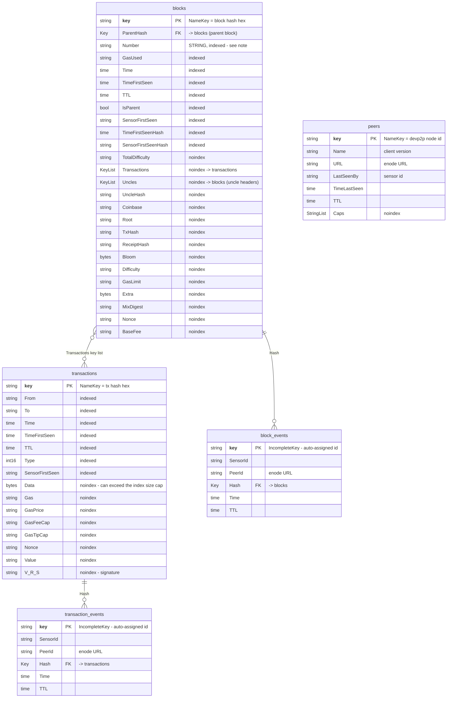
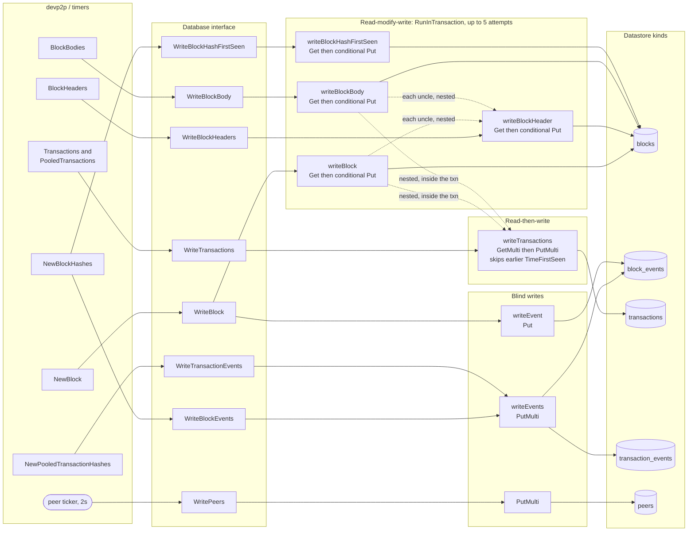

# Sensor Datastore data model

The entity kinds the `--database=datastore` backend writes, and how a devp2p message
becomes entities in them. The writer is `p2p/database/datastore.go`; the handlers
that drive it are in `p2p/protocol.go`. Kinds are Datastore's equivalent of tables,
and there is no DDL, so the structs in that file _are_ the schema.

See also: [ClickHouse data model](/cmd/p2p/sensor/clickhouse.md).

Unlike the ClickHouse backend, this one is a read-modify-write store: entities are
fetched and mutated in place to keep the earliest-seen timestamps. That shape is what
the ClickHouse schema was designed to stop emulating, so the two are not
column-for-column equivalents.

## Schema

### Kinds

Relationships are Datastore `*datastore.Key` references, not enforced foreign
keys — a key can point at an entity that does not exist yet, and routinely does
(an event is written for a hash before the block itself arrives).

`ParentHash` and the `Uncles` key list both reference other `blocks` entities. They
are annotated on their columns rather than drawn as relationships, since a
self-reference renders as an easily-missed loop (or nothing) depending on the
mermaid version.

`block_events` and `transaction_events` are the _same_ Go struct
(`DatastoreEvent`); they are separated only by the kind passed at key-creation
time, and the `Hash` reference points at `blocks` or `transactions` accordingly.

### What to know before querying it

- **`Number` is a string.** Range filters on it are therefore lexicographic over
  decimal text, so `Number >= "9"` excludes `"10"`. Every consumer that scans block
  ranges has to work around this, and `data-analysis/graph.go` carries an explicit
  warning about it. This is the single biggest reason the ClickHouse schema uses a
  real `UInt64`.
- **`noindex` is not cosmetic.** Datastore caps entities at 200 indexed properties
  and indexed byte slices at a maximum size, which is why `Data`, `Bloom` and
  `Extra` are excluded. The same cap is why the block-latency job has to drop
  `contract_stats` and `seal_time_contract_stats` from its metrics entity before
  writing.
- **`TTL` is a plain timestamp field, not an expiry mechanism.** Nothing deletes
  these entities automatically; `data-analysis/cleanup.go` queries `TTL <= now` and
  issues batched `DeleteMulti` calls. The ClickHouse schema replaces the whole file
  with `TTL` clauses that drop partitions.
- **Observation attributes live on the entity.** `TimeFirstSeen`,
  `SensorFirstSeen`, `TimeFirstSeenHash`, `SensorFirstSeenHash` and `IsParent` are
  stored on the block itself and updated in place, which is what forces the
  read-modify-write transactions.
- **Peer identity differs between kinds.** `peers` is keyed by devp2p node id, but
  `block_events.PeerId` and `transaction_events.PeerId` hold the _enode URL_
  (`peer.URLv4()`). They are different key spaces, so peers cannot be joined to
  events. That is why `NodeList` scans `block_events` ordered by `-Time` instead of
  reading `peers`.
- **Uncles are first-class blocks here.** `writeBlock` and `writeBlockBody` write
  each uncle header as its own `blocks` entity and link it via the `Uncles` key
  list. The ClickHouse backend records only the uncle hashes on `block_bodies`.

### Rough correspondence to the ClickHouse schema

Not a migration map — the grain differs on purpose — but useful for orientation.

| Datastore                                  | ClickHouse                                       |
| ------------------------------------------ | ------------------------------------------------ |
| `blocks` (header fields)                   | `blocks`                                         |
| `blocks.Transactions` / `Uncles` key lists | `block_txs` / `block_bodies.uncles`              |
| `blocks.TotalDifficulty`                   | `block_events.total_difficulty`                  |
| `blocks.TimeFirstSeen` / `SensorFirstSeen` | `block_events_first` (derived)                   |
| `blocks.TimeFirstSeenHash`                 | `block_events` with `source = 'hash_announce'`   |
| `blocks.IsParent`                          | `block_events` with `source = 'header_backfill'` |
| `block_events`                             | `block_events`                                   |
| `transactions`                             | `transactions` (+ `tx_type`, selector, chain id) |
| `transaction_events`                       | `tx_events`                                      |
| `peers`                                    | `peers` → `peers_current`                        |
| `TTL` field + cleanup job                  | `TTL` clauses, whole-partition drops             |
| n/a                                        | `block_forks`, `v_*` views                       |

## Write paths

The contrast with the ClickHouse backend is the whole point of this page: almost
every path here is a **read-modify-write** inside a `RunInTransaction` retry loop
(`MaxAttempts = 5`), and four separate paths contend on the _same_ `blocks` entity.
That is what keeps the earliest-seen timestamps correct, and it is the shape the
ClickHouse schema was designed to stop emulating.

Writes are dispatched through `runAsync`, a semaphore sized by
`--max-db-concurrency` (default 10000). `Close` acquires every slot to guarantee no
write is in flight before closing the client.

### The dotted edges

They are the part that does not show up in a method list, and they are worth
tracing. `writeBlock` and `writeBlockBody` call `writeTransactions` (itself a
`GetMulti` + `PutMulti`) and `writeBlockHeader` (itself a whole transaction) _from
inside their own transaction closure_. On contention the closure re-runs, so those
nested round trips re-run with it, up to five times.

### Per-method detail

| Method                    | Path                        | Shape                                                                                           |
| ------------------------- | --------------------------- | ----------------------------------------------------------------------------------------------- |
| `WriteBlock`              | `writeEvent` + `writeBlock` | Blind event `Put`, then RMW on the block; conditionally nests transactions and uncle headers    |
| `WriteBlockHeaders`       | `writeBlockHeader`          | RMW per header; skips the write if an equal-or-earlier `TimeFirstSeen` exists                   |
| `WriteBlockBody`          | `writeBlockBody`            | RMW; fills `Transactions` / `Uncles` key lists only if still nil                                |
| `WriteBlockEvents`        | `writeEvents`               | Batched `PutMulti`, no read. Announced heights are discarded                                    |
| `WriteBlockHashFirstSeen` | `writeBlockHashFirstSeen`   | RMW on `blocks` purely to keep the earliest hash-announce time                                  |
| `WriteTransactions`       | `writeTransactions`         | `GetMulti` to skip txs already stored with an earlier or equal `TimeFirstSeen`, then `PutMulti` |
| `WriteTransactionEvents`  | `writeEvents`               | Batched `PutMulti`, no read                                                                     |
| `WritePeers`              | `PutMulti`                  | One entity per connected peer, every 2s                                                         |
| `HasBlock`                | `Get`                       | Point lookup by block key                                                                       |
| `NodeList`                | query                       | Scans `block_events` ordered by `-Time`, collecting distinct `PeerId`                           |

Note that `WriteBlockHeaders` and `WriteBlockBody` deliberately write **no** events:
headers and bodies only arrive because the sensor asked for them, so the event is
recorded when the hash announcement comes in instead.

### Why this differs from ClickHouse

|                           | Datastore                           | ClickHouse                                 |
| ------------------------- | ----------------------------------- | ------------------------------------------ |
| Write shape               | read-modify-write per entity        | append-only, batched                       |
| Contention                | 4 paths on the same `blocks` entity | none; writers never read                   |
| "Keep the earliest event" | `tx.Get` then conditional `tx.Put`  | derived at read time from the event stream |
| `WriteBlockHashFirstSeen` | its own transaction on `blocks`     | no-op                                      |
| Backpressure              | semaphore, blocks the caller        | fixed buffers, drop-on-full                |
| Peer id in events         | enode URL (`peer.URLv4()`)          | devp2p node id                             |
| Block ↔ tx link           | key list on the block entity        | `block_txs` table                          |
| Uncles                    | written as full `blocks` entities   | hashes on `block_bodies`                   |
| Expiry                    | `TTL` field + a manual delete job   | `TTL` clauses, whole-partition drops       |
| Block numbers             | strings, lexicographic ranges       | `UInt64`                                   |
| `NodeList`                | scan `block_events` by `-Time`      | `peers_current` rollup                     |
