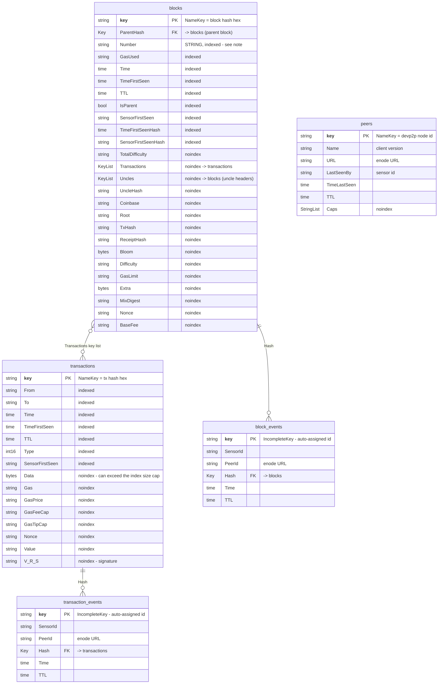

# Sensor Datastore schema

The entity kinds the `--database=datastore` backend writes
(`p2p/database/datastore.go`). Kinds are Datastore's equivalent of tables; there
is no DDL, so the structs in that file *are* the schema.

See also: [Datastore write paths](/cmd/p2p/sensor/write-paths-datastore.md),
[ClickHouse schema](/cmd/p2p/sensor/schema-clickhouse.md).

Unlike the ClickHouse backend, this one is a read-modify-write store: entities are
fetched and mutated in place to keep the earliest-seen timestamps. That shape is
what the ClickHouse schema was designed to stop emulating, so the two are not
column-for-column equivalents.

## Kinds

Relationships are Datastore `*datastore.Key` references, not enforced foreign
keys — a key can point at an entity that does not exist yet, and routinely does
(an event is written for a hash before the block itself arrives).

`ParentHash` and the `Uncles` key list both reference other `blocks` entities. They
are annotated on their columns rather than drawn as relationships, since a
self-reference renders as an easily-missed loop (or nothing) depending on the
mermaid version.

`block_events` and `transaction_events` are the *same* Go struct
(`DatastoreEvent`); they are separated only by the kind passed at key-creation
time, and the `Hash` reference points at `blocks` or `transactions` accordingly.

## What to know before querying it

- **`Number` is a string.** Range filters on it are therefore lexicographic over
  decimal text, so `Number >= "9"` excludes `"10"`. Every consumer that scans block
  ranges has to work around this, and `data-analysis/graph.go` carries an explicit
  warning about it. This is the single biggest reason the ClickHouse schema uses a
  real `UInt64`.
- **`noindex` is not cosmetic.** Datastore caps entities at 200 indexed properties
  and indexed byte slices at a maximum size, which is why `Data`, `Bloom` and
  `Extra` are excluded. The same cap is why the block-latency job has to drop
  `contract_stats` and `seal_time_contract_stats` from its metrics entity before
  writing.
- **`TTL` is a plain timestamp field, not an expiry mechanism.** Nothing deletes
  these entities automatically; `data-analysis/cleanup.go` queries `TTL <= now` and
  issues batched `DeleteMulti` calls. The ClickHouse schema replaces the whole file
  with `TTL` clauses that drop partitions.
- **Observation attributes live on the entity.** `TimeFirstSeen`,
  `SensorFirstSeen`, `TimeFirstSeenHash`, `SensorFirstSeenHash` and `IsParent` are
  stored on the block itself and updated in place, which is what forces the
  read-modify-write transactions.
- **Peer identity differs between kinds.** `peers` is keyed by devp2p node id, but
  `block_events.PeerId` and `transaction_events.PeerId` hold the *enode URL*
  (`peer.URLv4()`). They are different key spaces, so peers cannot be joined to
  events. That is why `NodeList` scans `block_events` ordered by `-Time` instead of
  reading `peers`.
- **Uncles are first-class blocks here.** `writeBlock` and `writeBlockBody` write
  each uncle header as its own `blocks` entity and link it via the `Uncles` key
  list. The ClickHouse backend records only the uncle hashes on `block_bodies`.

## Rough correspondence to the ClickHouse schema

Not a migration map — the grain differs on purpose — but useful for orientation.

| Datastore | ClickHouse |
| --- | --- |
| `blocks` (header fields) | `blocks` |
| `blocks.Transactions` / `Uncles` key lists | `block_txs` / `block_bodies.uncles` |
| `blocks.TotalDifficulty` | `block_events.total_difficulty` |
| `blocks.TimeFirstSeen` / `SensorFirstSeen` | `block_events_first` (derived) |
| `blocks.TimeFirstSeenHash` | `block_events` with `source = 'hash_announce'` |
| `blocks.IsParent` | `block_events` with `source = 'header_backfill'` |
| `block_events` | `block_events` |
| `transactions` | `transactions` (+ `tx_type`, selector, chain id) |
| `transaction_events` | `tx_events` |
| `peers` | `peer_snapshots` → `peers_current` |
| `TTL` field + cleanup job | `TTL` clauses, whole-partition drops |
| n/a | `block_forks`, `v_*` views |
