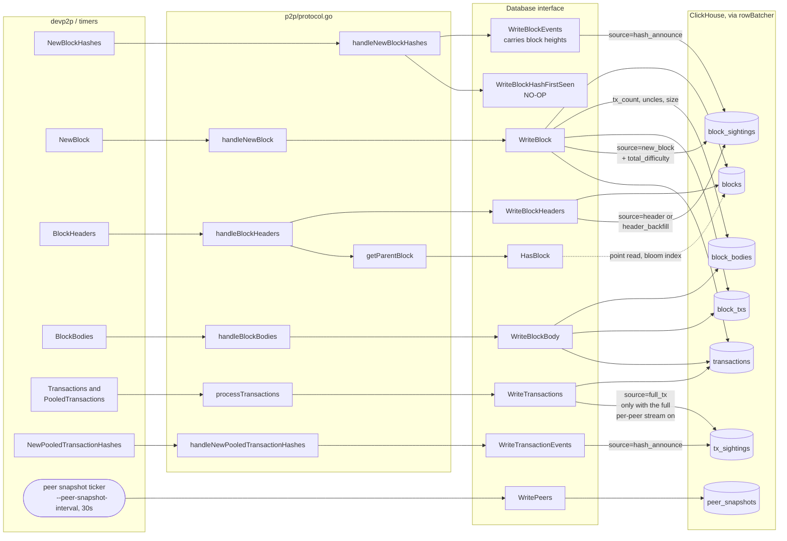

# Sensor ClickHouse write paths

How a devp2p message becomes rows in ClickHouse, for `--database=clickhouse`
(`p2p/database/clickhouse.go`). Handlers are in `p2p/protocol.go`.

See also: [ClickHouse schema](/cmd/p2p/sensor/schema-clickhouse.md),
[Datastore write paths](/cmd/p2p/sensor/write-paths-datastore.md).

This backend is **pure append**. No `Write*` method reads a row back in order to
modify it; the only read on the path is `HasBlock`, used to decide whether to
backfill a missing parent.

Every write enqueues onto a per-table `rowBatcher` that flushes on a 1s tick or a
size threshold, retrying a failed batch up to 3 times. `add` is **non-blocking with
drop-on-full**, so a slow or unreachable database can never stall the sensor's hot
path — it drops rows and logs the count instead.

## Per-method detail

| Method | Writes | Notes |
| --- | --- | --- |
| `WriteBlock` | `blocks`, `block_bodies`, `block_txs`, `block_sightings`, `transactions` | The only path with the full block, so the only one that knows `size_bytes` |
| `WriteBlockHeaders` | `blocks`, `block_sightings` | `isParent` selects `source = 'header_backfill'` |
| `WriteBlockBody` | `block_bodies`, `block_txs`, `transactions` | No sighting: bodies arrive only when requested |
| `WriteBlockEvents` | `block_sightings` | Takes `[]BlockAnnouncement`, so heights reach the row |
| `WriteBlockHashFirstSeen` | nothing | Derived instead, see below |
| `WriteTransactions` | `transactions`, `tx_sightings` | Sighting gated on the full per-peer stream flag |
| `WriteTransactionEvents` | `tx_sightings` | |
| `WritePeers` | `peer_snapshots` | Own ticker, not the 2s metrics tick |
| `HasBlock` | — | Reads `blocks` by hash, once per new header |

## Five things worth reading off this

**`WriteBlockHashFirstSeen` is a no-op.** Earliest first-seen is derived from the
sighting stream by the `block_sighting_first` materialized view, so there is nothing
to stamp on the block. The interface method stays because the Datastore backend
does need it.

**`blocks` is written by two paths, and that is safe.** Both `WriteBlock` and
`WriteBlockHeaders` write a *complete* header row — every column is a pure function
of the header — so ordering between them cannot matter. The fields a header cannot
carry (`tx_count`, `uncle_count`, `size_bytes`, `uncles`) go to `block_bodies`,
which the header path never touches.

This is the defect the schema redesign fixed. Previously the header path wrote
`tx_count = 0` onto the block row, and because the engine kept the row with the
newest version column, a header arriving *after* the full block — routine during
parent backfill — permanently replaced the real counts with zeros. There is now a
regression test for exactly that ordering
(`TestClickHouseHeaderDoesNotClobberBody`).

**`total_difficulty` rides on the sighting, not the block.** It comes from the
`NewBlock` announcement, so it is an attribute of that announcement rather than of
the block. Header and hash-announce sightings write `0`.

**Block heights have to reach `WriteBlockEvents`.** `block_sightings` leads its sort
key with `block_number`, which is what lets a reader fetch a whole range in one
query instead of one point lookup per hash. `NewBlockHashes` carries the numbers, so
the interface takes `[]database.BlockAnnouncement` rather than bare hashes —
and since `p2p.NewBlockHashesPacket` is defined as a slice of exactly that type, a
decoded packet is handed to the backend with no copy or conversion.

**Peer identity is the devp2p node id**, not the enode URL, on both sighting
streams — so sightings join to `peer_snapshots` / `peers_current`. The Datastore
backend uses `peer.URLv4()` here, which is why peers and events cannot be joined on
that backend.

## Write volume

Batch sizes are per table (`chBlockBatch` and friends): 5,000 blocks, 5,000 bodies,
20,000 block-txs, 50,000 block sightings, 20,000 transactions, 50,000 tx sightings,
2,000 peers.

`tx_sightings` is the volume driver. The `--write-tx-events` /
`--write-first-tx-event` pair controls whether it receives every announcement or
only first sightings; production runs the latter.

Peer snapshots are their own cadence. The 2s tick in `sensor.go` still drives the
Prometheus gauge and the local peer file, but persisting up to `--max-peers` rows
every 2s is a large amount of near-duplicate data to answer one question ("who is
connected now"), so the database write runs on `--peer-snapshot-interval` (30s) and
reads go through `peers_current`.
