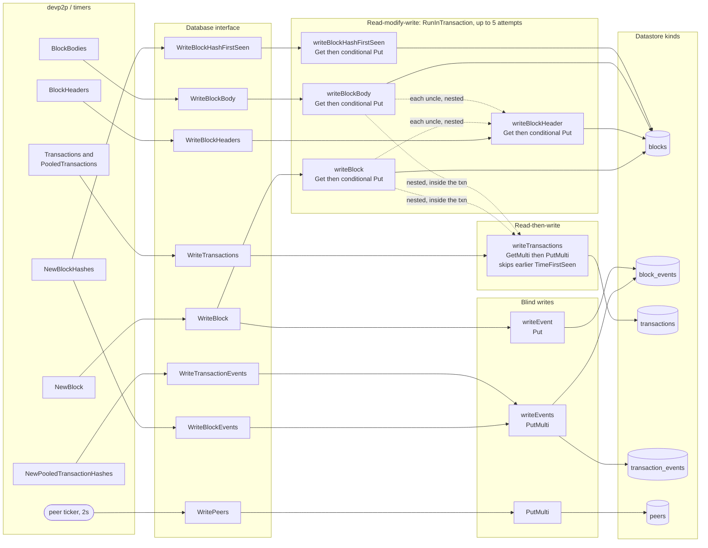

# Sensor Datastore write paths

How a devp2p message becomes entities in GCP Datastore, for
`--database=datastore` (`p2p/database/datastore.go`). Handlers are in
`p2p/protocol.go`.

See also: [Datastore schema](/cmd/p2p/sensor/schema-datastore.md),
[ClickHouse write paths](/cmd/p2p/sensor/write-paths-clickhouse.md).

The contrast with the ClickHouse backend is the whole point of this page: almost
every path here is a **read-modify-write** inside a `RunInTransaction` retry loop
(`MaxAttempts = 5`), and four separate paths contend on the *same* `blocks` entity.
That is what keeps the earliest-seen timestamps correct, and it is the shape the
ClickHouse schema was designed to stop emulating.

Writes are dispatched through `runAsync`, a semaphore sized by
`--max-db-concurrency` (default 10000). `Close` acquires every slot to guarantee no
write is in flight before closing the client.

## The dotted edges

They are the part that does not show up in a method list, and they are worth
tracing. `writeBlock` and `writeBlockBody` call `writeTransactions` (itself a
`GetMulti` + `PutMulti`) and `writeBlockHeader` (itself a whole transaction) *from
inside their own transaction closure*. On contention the closure re-runs, so those
nested round trips re-run with it, up to five times.

## Per-method detail

| Method | Path | Shape |
| --- | --- | --- |
| `WriteBlock` | `writeEvent` + `writeBlock` | Blind event `Put`, then RMW on the block; conditionally nests transactions and uncle headers |
| `WriteBlockHeaders` | `writeBlockHeader` | RMW per header; skips the write if an equal-or-earlier `TimeFirstSeen` exists |
| `WriteBlockBody` | `writeBlockBody` | RMW; fills `Transactions` / `Uncles` key lists only if still nil |
| `WriteBlockEvents` | `writeEvents` | Batched `PutMulti`, no read. Announced heights are discarded |
| `WriteBlockHashFirstSeen` | `writeBlockHashFirstSeen` | RMW on `blocks` purely to keep the earliest hash-announce time |
| `WriteTransactions` | `writeTransactions` | `GetMulti` to skip txs already stored with an earlier or equal `TimeFirstSeen`, then `PutMulti` |
| `WriteTransactionEvents` | `writeEvents` | Batched `PutMulti`, no read |
| `WritePeers` | `PutMulti` | One entity per connected peer, every 2s |
| `HasBlock` | `Get` | Point lookup by block key |
| `NodeList` | query | Scans `block_events` ordered by `-Time`, collecting distinct `PeerId` |

Note that `WriteBlockHeaders` and `WriteBlockBody` deliberately write **no** events:
headers and bodies only arrive because the sensor asked for them, so the sighting is
recorded when the hash announcement comes in instead.

## Why this differs from ClickHouse

| | Datastore | ClickHouse |
| --- | --- | --- |
| Write shape | read-modify-write per entity | append-only, batched |
| Contention | 4 paths on the same `blocks` entity | none; writers never read |
| "Keep the earliest sighting" | `tx.Get` then conditional `tx.Put` | derived at read time from the sighting stream |
| `WriteBlockHashFirstSeen` | its own transaction on `blocks` | no-op |
| Backpressure | semaphore, blocks the caller | fixed buffers, drop-on-full |
| Peer id in events | enode URL (`peer.URLv4()`) | devp2p node id |
| Block ↔ tx link | key list on the block entity | `block_txs` table |
| Uncles | written as full `blocks` entities | hashes on `block_bodies` |
| Expiry | `TTL` field + a manual delete job | `TTL` clauses, whole-partition drops |
| Block numbers | strings, lexicographic ranges | `UInt64` |
| `NodeList` | scan `block_events` by `-Time` | `peers_current` rollup |
