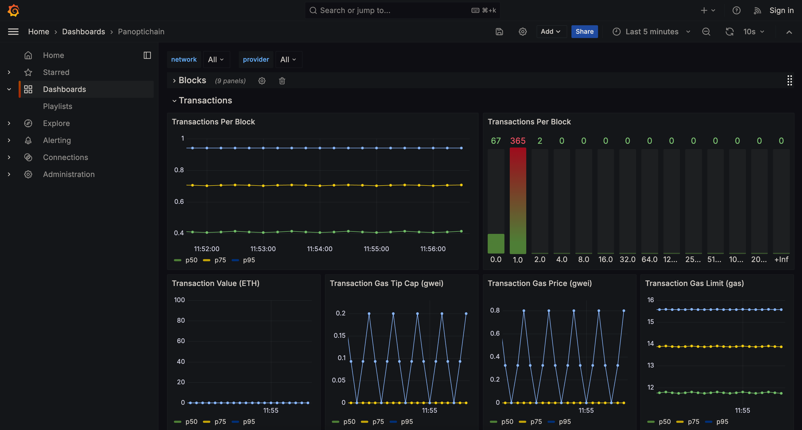
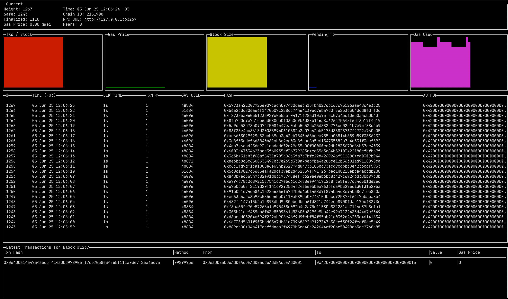

# Load Testing Guide: Using polycli with Kurtosis

## Overview

We frequently receive questions about TPS (transactions per second) benchmarks and how to stress test various types of transactions. Since `polycli` already includes a suite of common load generation scenarios, this guide aims to help
developers and integration teams perform realistic and reproducible load tests against Kurtosis-based environments.

This document focuses on:

- Practical examples using `polycli` and `Kurtosis`
- Standardized, reproducible workflows
- Reference TPS numbers for baseline performance (e.g., `CDK-Erigon`, `OP-Geth`)

## Goals

- Enable teams to run meaningful load tests on different blockchain stacks
- Provide a consistent, easy-to-follow methodology using `Kurtosis` and `polycli`
- Reduce confusion around setup and execution
- Offer baseline metrics for guidance and comparison

## Load Test Scenarios

The following load scenarios are supported out of the box in `polycli`:

1. **Native Token Transfers using EOAs**
2. **ERC20 Token Transfers**
3. **NFT Mints** (ERC721 and ERC1155)
4. **Uniswap-style Swaps**

Each scenario includes example commands and configuration tips to simulate realistic conditions.

---

## Prerequisites

- [Kurtosis CLI](https://docs.kurtosis.com/) installed
- [polycli](https://github.com/0xpolygon/polygon-cli?tab=readme-ov-file#install) installed and configured
- Set `$private_key` with the private key of the funded account available to `polycli`
- Access to performance monitoring tools (optional but recommended, e.g., `Grafana` + `Prometheus`)

## Configuring Kurtosis for Load Testing

Launch a Kurtosis environment with your desired stack (e.g., `CDK-Erigon` or `OP-Geth`), for this example we will use
the [kurtosis-cdk](https://github.com/0xPolygon/kurtosis-cdk) repository:

this command will start the latest version of the environment provided by the `kurtosis-cdk` repository
````bash
kurtosis run --enclave cdk github.com/0xPolygon/kurtosis-cdk
````

if you want to ensure you will run either `cdk-erigon` or `op-geth`, ensure to set the parameter `deployment_stages.deploy_optimism_rollup` accordingly, `false` for `cdk-erigon` and `true` for `op-geth`.

````bash
kurtosis run --enclave cdk github.com/0xPolygon/kurtosis-cdk '{"deployment_stages": {"deploy_optimism_rollup": false}}'
````

After the whole environment is started, set the env var `$rpc_url` with the RPC endpoint URL that will be used by
`polycli`.

for `op-geth`:
```bash
export rpc_url=$(kurtosis port print cdk op-el-1-op-geth-op-node-001 rpc)
```

for `cdk-erigon`:
```bash
export rpc_url=$(kurtosis port print cdk cdk-erigon-rpc-001 rpc)
```

Last, but not least, all the examples below will use the `$private_key` environment variable, ensure this env var
contains the correct private key for the network your kurtosis environment is running.

for `op-geth`:
```bash
export private_key=0xac0974bec39a17e36ba4a6b4d238ff944bacb478cbed5efcae784d7bf4f2ff80
```

for `cdk-erigon`:
```bash
export private_key=0x12d7de8621a77640c9241b2595ba78ce443d05e94090365ab3bb5e19df82c625
```


## Running Load Tests with polycli

`polycli` comes with a built-in command called `loadtest`, check more details about this command with:

```bash
polycli loadtest --help
```

Before starting using `polycli` to run load tests, it's important to mention some important flags to the `loadtest` 
command.

  - `--rpc-url`: defines the RPC URL that the test will call when calling the network RPC.
  - `--private-key`: defines the private key of the account used to send the transactions to the network.
  - `--mode`: defines what kind of load test you want to perform, EOA txs, ERC20, etc.
  - `--verbosity`: defines the log level that will be printed to the console:
    - `0`   - silent
    - `100` - panic
    - `200` - fatal
    - `300` - error
    - `400` - warn
    - `500` - info (default)
    - `600` - debug
    - `700` - trace
  - `--requests`: defines the number of requests that will be sent to the network by each concurrent execution.
  - `--concurrency`: define the number of concurrent executions of the load test. For example, if `--requests` is set to
  `10` and `--concurrency` is set to `2`, then 2 load test executions will start concurrently and each concurrent
  execution will send 10 requests, making 20 requests in total.
  - `--rate-limit`: defines the number of requests that can be sent per second to the network, this limits the requests
  sent across the concurrent executions. _If you want to check TPS, ensure to set this parameter manually accordingly to
  the environment max capacity because the default value is 4 txs per second._

Here is a template that you can use to start writing you own load tests using `polycli`:

```bash
polycli loadtest \
  --rpc-url <RPC_URL>
  --private-key <PRIVATE-KEY>
  --mode <MODE> \
  --verbosity <LOG_LEVEL> \
  --concurrency <NUMBER_OF_CONCURRENT_REQUESTS> \
  --requests <NUMBER_OF_REQUESTS> \
  --rate-limit <MAX_REQUESTS_PER_SECOND>
```

As mentioned before, `polycli` test various types of transactions, please take a look for the flag `--mode` for the
different ones.

>In the steps below you will find examples on how to run `polycli` for specific scenarios.

### Native Token Transfers

```bash
polycli loadtest --rpc-url $rpc_url --private-key $private_key --mode t
```

### ERC20 Token Transfers

```bash
polycli loadtest --rpc-url $rpc_url --private-key $private_key --mode 2
```

### NFT Mints (ERC721/1155)

```bash
polycli loadtest --rpc-url $rpc_url --private-key $private_key --mode 7
```

### Uniswap-style Swaps

```bash
polycli loadtest --rpc-url $rpc_url --private-key $private_key --mode v3
```

## Multi-account support

The loadtest command provided by `polycli` send all the transactions with the same sender by default, but some times
the test requires multiple accounts to be used in order to avoid the pool queue limits, the `polycli` supports
multi-account by setting the following flags:

- `sending-accounts-count`: defines the number of accounts that will be created to send the test txs
- `account-funding-amount`: defines the amount that will be funded to each sending account that will be created
- `pre-fund-sending-accounts`: if set to true, the sending account will be funded at the start of the execution of
the load test, funding all the created accounts concurrently, otherwise all sending accounts will be funded only when
used for the first time.
- `keep-funded-amount`: by default, at the final of the load test execution, all the funds funded to the sending
accounts that were created during the execution will be returned to the funding account, which is the account set in the 
`--private-key` flag. In case you want the funded funds to remain in the created accounts, set it to `true`
- `sending-accounts-file`: defines the path to a file containing a list of private keys to be used by the load test.
Instead of creating new accounts, the test will use only the accounts defined in the file with the private keys as the
accounts that will send the test txs

## Proxy support

Generally network RPCs will have some sort of protection to avoid DoS attacks, for cases where you have to by pass the
IP check or any other change to the requests made by the `polycli` load test, you can specify the `--proxy` flag with
the proxy url.

## Example Benchmark Results

The numbers below were obtained from the execution of the steps above with:

this machine:

```
- MacBook Pro - 14" 2021
- Chip Apple M1 Pro
- 16GB Ram
- macOS Sequoia 15.5
```

these extra flags:

```
--concurrency 20
--requests 50
--rate-limit 2000
```

**Note**: These numbers are based on controlled testnet conditions and may vary depending on hardware, network 
conditions, and configuration. 

| Scenario             | CDK-Erigon | OP-Geth  | 
|----------------------|------------|----------|
| Native Transfers     | ~182 TPS   | ~181 TPS |
| ERC20 Transfers      | ~171 TPS   | ~177 TPS |
| NFT Mints (ERC721)   | ~164 TPS   | ~178 TPS |
| Uniswap Swaps        | ~119 TPS   | ~160 TPS |

## Monitoring and Visualization (Optional)

### Grafana

The `cdk-kurtosis` package also supports additional services to run alongside the network, you can find more details
[here](https://github.com/0xPolygon/kurtosis-cdk/blob/main/docs/additional-services.md).

The additional service called `observability` uses the following tools:
- [panoptichain](https://github.com/0xPolygon/panoptichain)
- [prometheus](https://prometheus.io/)
- [grafana](https://grafana.com/)

These tools mentioned above are already configured to extract important information from the network and provide it in a
friendly dashboard that can be accessed via browser. The URL is exposed when the kurtosis package is initialized with
the `observability` service enabled and here is how you can enabled it:

````bash
kurtosis run --enclave cdk github.com/0xPolygon/kurtosis-cdk '{"args": {"additional_services": ["observability"]}}'
````

Now that the environment is running, we can get the URL to access the observability dashboard by running:
```bash
kurtosis port print cdk grafana-001 dashboards
```

Access the dashboard URL in the browser and go to Menu > Dashboards > Panoptichain


### polycli monitor

`polycli` also provides a way to observe networks with the command `monitor`.

```bash
polycli monitor --rpc-url $rpc_url
```



---

## Source

For more details, see: 
- [`polycli` repository](https://github.com/0xPolygon/polygon-cli`)
- [`kurtosis-cdk` repository](https://github.com/0xPolygon/kurtosis-cdk`).

---

_Last updated: 05-JUN-2025_
